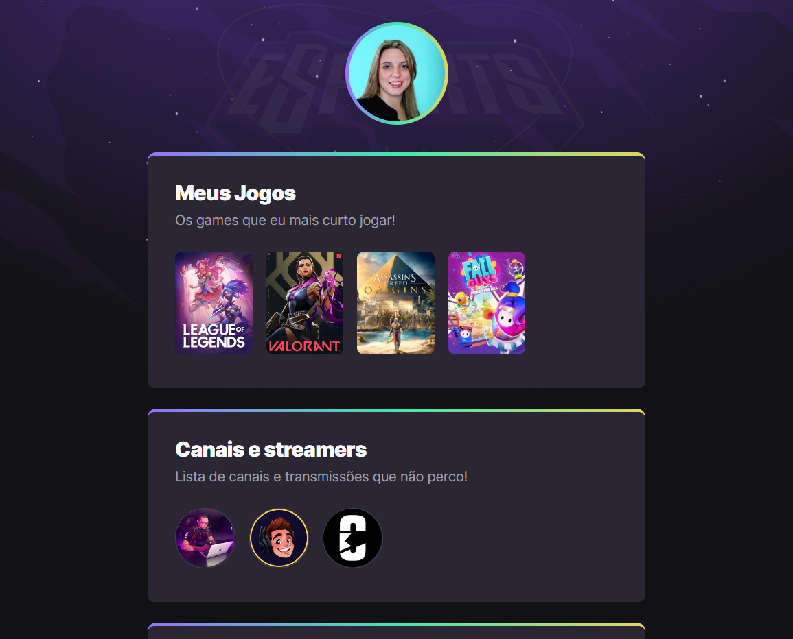

# NLW eSports | Explorer Track -  Rocketseat School 🚀

This project was developed during the Next Level Week event from Rocketseat School.

The challenge of the Explorer track was to develop a web page to keep the user's favorite games and streamers.

The page in desktop format can be seen in the image below:

## 🛠️ Tecnologies

 
  
  

 

[🔗 Click here to acess](https://jeadamek.github.io/nlw-esports-explorer/)